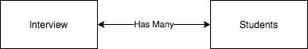

## Interview Creation App

### Entity Relationship


### To Start the project

#### Backend
  create a virtual env and install the requirements
  ```
    pip install -r requirements.txt
    python manage.py run
  ```
  This will start the server at localhost:5000

#### Frontend
  go to the `frontend` directory
  ```
  yarn install
  yarn run
  ```
  This will start the dev server to localhost:3000